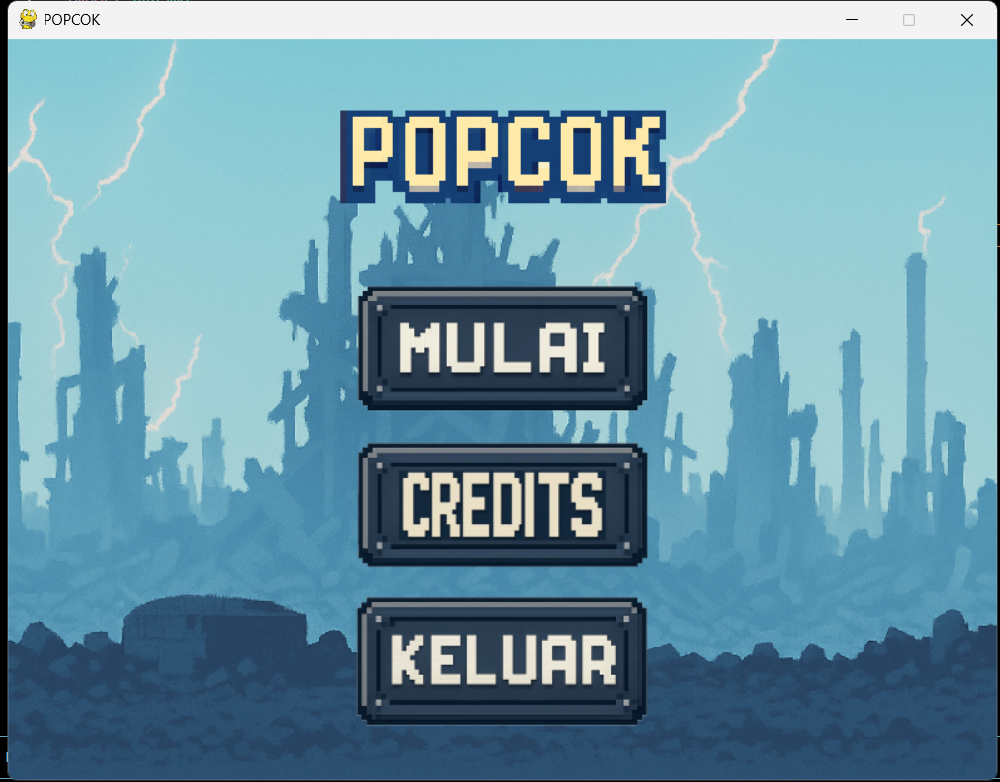
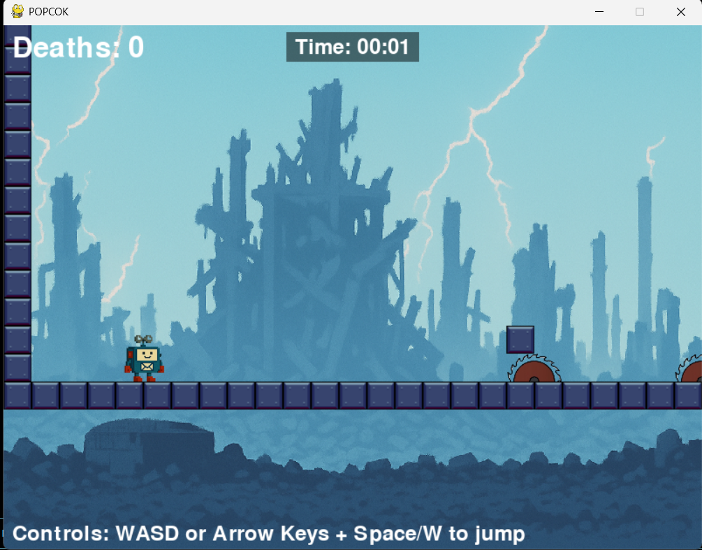
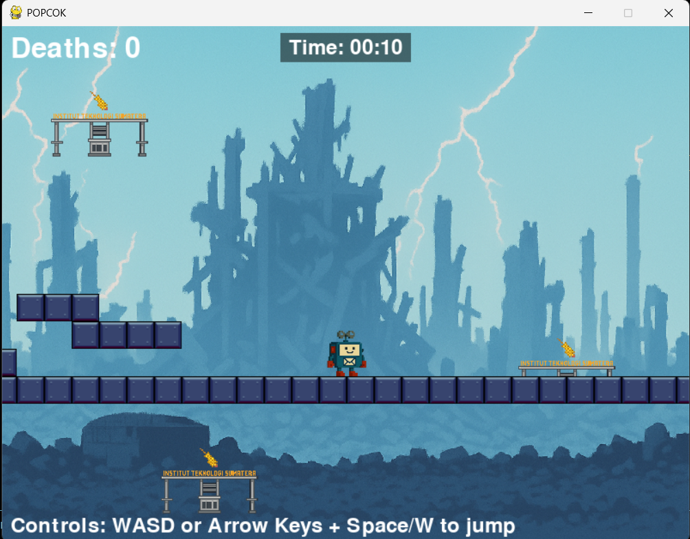
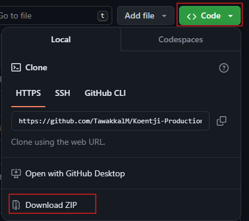

# Link Video 

[Demo Aplikasi]("OTW ")


# <h1 align="center">POPCOK</h1>

## Deskripsi

<p align="justify">
  Popcok sendiri ialah robot kurir rahasia yang ditugaskan 
mengantarkan surat superrahasia. Setiap kali ia bertemu musuh 
atau terperangkap jebakan mematikan, protokol akhir meledakan
diri  akan otomatis aktif untuk melindungi dokumen yang dibawanya. 
Namun, tujuan utama Popcok tetap sama : selamat tiba di markas 
tanpa kehilangan surat penting tersebut.  Ayo segera bantu POPCOK 
mengantarkan surat dan kamu juga bisa tau isi surat yang dibawa POPCOK.
Penasaran kan,,,sama .
</p>

## Panduan 

1. Ini adalah tampilan dari menu game. Untuk memulai klik tombol mulai
   dan terdapat tombol credits untuk menampilkan cerita awal si POPCOK.
   Dan tombol keluar untuk keluar 



2. saat mulai anda akan disuguhkan dengan tampilan game utama 
   lalu anda dapat menggerakan POPCOK dengan W (untuk lompat),
   A(untuk ke kiri),dan D (kekanan).dan juga anda dapat mengarahkan
   karakter popcok dengan panah kanan kiri serta space untuk lompat
   pada keyboard 



3. Tolong lah popcok untuk melewati rintangan, jebakan ,musuh yang 
ngeselin ini. Bantulah Popcok sampai finnish agar suratnya bisa 
selamat dan kamu juga bisa tau isi suratnya 



## Bahasa Yang Digunakan

<ol>
    <li> Python</li>
</ol>


## Cara menjalankan App
<p>1. Pastikan sudah mendownload python dan jika belum installer di https://www.python.org/
      dan centang opsi “Add Python to PATH” saat instalasi</p>
<p>2. Download seluruh file, seperti pada gambar. Jika sudah ekstrak terlebih dahulu.</p>


<p align="center">
  
</p>
<p>3. Install library pygame</p>

<p align="justify">
Install Pygame Buka Command Prompt (CMD) di folder game 
(atau jalankan cmd di folder proyek), lalu ketik:
</p>

<p>Untuk Windows</p>

```bash
py -m pip install -U pygame --user
```

<p>Untuk Mac</p>

```bash
python3 -m pip install -U pygame --user
```
<p>4. Masuk ke folder POPCOK dengan gunakan perintah pada cmd " cd \POPCOK "</p>

<p>5. Setelah berada di dalam folder POPCOK jalankan </p>
<p>Untuk Windows</p>

```bash
py main.py

```

<p>Untuk Mac</p>

```bash
python3 main.py
```

<p>and Enjjooyyyy.........walaupun POPCOK ngeselin</p>


## Contributors

| Nama                      | NIM       | Kontribusi                 | Link Github                                                                  |
| --------------------------| --------- | -------------------------- | ---------------------------------------------------------------------------- |
| Tengku Hafid Diraputra    | 123140043 | Programmer,Project Leader  | [@ThDptr](https://github.com/ThDptr)                                         |
| Andika Rahman Pratama     | 123140090 | Programmer                 | [@11-090-AndikaRahmanPratama](https://github.com/11-090-AndikaRahmanPratama) |
| Bayu Brigas Novaldi       | 123140072 | Programmer                 | [@Bayubrigas](https://github.com/Bayubrigas)                                 |
| Ilyas Ramadhan            | 123140016 | Designer                   | [@03ilyas](https://github.com/03ilyas)                                       |
| Andre Prasetya Daely      | 123140131 | Designer                   | [@andree050505](http://github.com/andree050505)                              |

